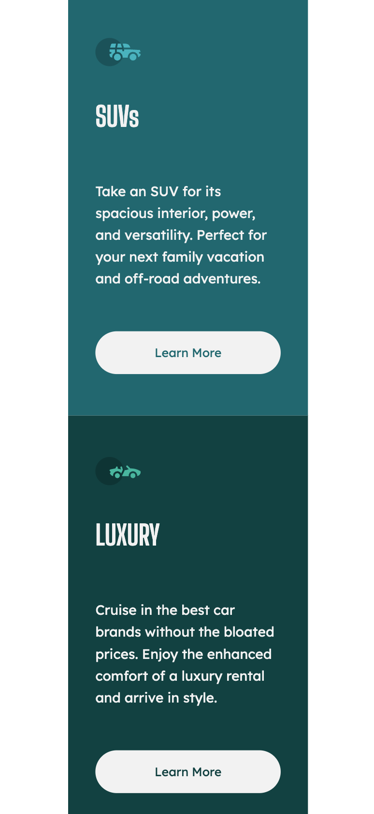

# Frontend Mentor - 3-column card component solution

This is a solution to the [3-column preview card component challenge on Frontend Mentor](https://www.frontendmentor.io/challenges/3column-preview-card-component-pH92eAR2-). Frontend Mentor challenges help you improve your coding skills by building realistic projects. 

## Table of contents

- [Frontend Mentor - 3-column card component solution](#frontend-mentor---3-column-card-component-solution)
  - [Table of contents](#table-of-contents)
  - [Overview](#overview)
    - [The challenge](#the-challenge)
    - [Screenshot](#screenshot)
    - [Links](#links)
  - [My process](#my-process)
    - [Built with](#built-with)
    - [What I learned](#what-i-learned)
    - [Continued development](#continued-development)
  - [Author](#author)

## Overview

### The challenge

Users should be able to:

- View the optimal layout depending on their device's screen size
- See hover states for interactive elements

### Screenshot





### Links

- Solution URL: [Github Repository](https://github.com/mariabrock/frontendmentor-3-card-component)
- Live Site URL: [Github Pages]()

## My process

### Built with

- Semantic HTML5 markup
- CSS custom properties
- Flexbox
- CSS Grid
- Mobile-first workflow
- Javascript

### What I learned

Fun html:

```html
<div class="sedan">
        
        <h1 class="header">Sedans</h1>
        <p class="text">Choose a sedan for its affordability and excellent fuel economy. Ideal  for cruising in the city or on your next road trip.</p>
        <button>Learn More</button>
      </div>
```

Fun css:
```css
  .sedan, .suv, .luxury {
    display: flex;
    flex-direction: column;
    justify-content: space-around;
    line-height: 1.6;
    color: hsl(0, 0%, 95%);
    padding: 2rem;
    max-width: 240px;
    height: 400px;
  }

  .sedan {
    background-color: hsl(31, 77%, 52%);
  }

  .suv {
    background-color: hsl(184, 100%, 22%);
  }

  .luxury {
    background-color: hsl(179, 100%, 13%);
}
```

### Continued development

## Author

- Github - [@mariabrock](https://github.com/mariabrock)
- Frontend Mentor - [@mariabrock](https://www.frontendmentor.io/profile/mariabrock)
- LinkedIn - [@mariabrock](https://www.linkedin.com/in/maria-brock/)
